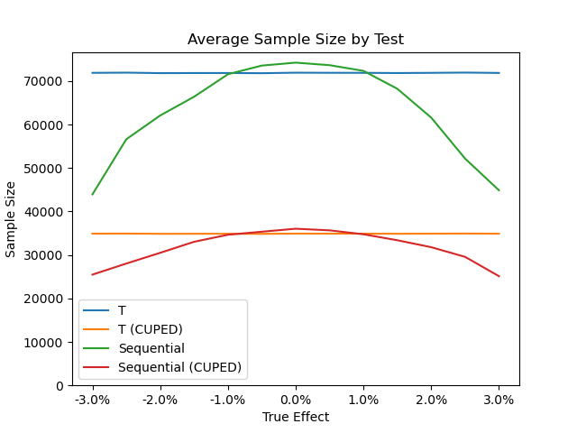
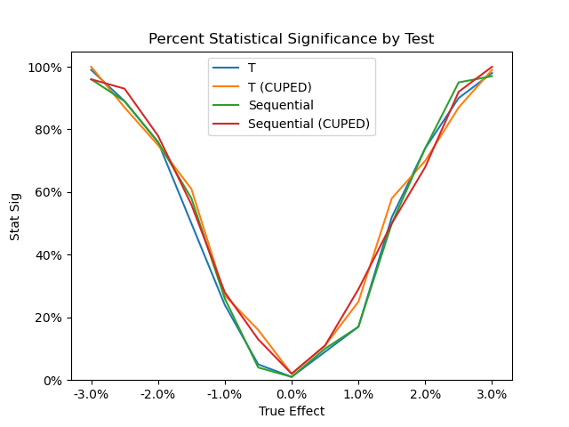

# Comparing Common Experiment Methods

## Introduction

A/B testing is used extensively to test whether changes to a product or service affect users who experience it. The standard approach using a t-test is effective and but has drawbacks. Other common methods were created to address downsides to the t-test, and this work evaluates two of them: Controlled experiment Using Pre-Experiment Data (CUPED) adjustment, and sequential testing. Introductions and evaluations are provided for each framework.

## T-test

In practical terms, the t-test works by:

1. Comparing outcomes between a group that experiences a change (treatment) and a group that doesn't experience a change (control).
2. Measuring how much the outcomes vary within each group.
3. Estimating how likely the difference measured in Step A can be explained by the natural variance measured in Step B. More natural variation means you could see a larger range of values by chance, so a larger difference in outcomes is required to be considered unlikely.

To make it more intuitive, imagine someone wants to see whether new shoes can help them run faster than their friend. If both normally run between 5:30 and 6:30, it's hard to say whether a 5:45 mile versus their friend's 6:00 mile was caused by the shoes. But if both normally run between 5:55 and 6:05, that same 5:45 versus 6:00 mile provides much stronger evidence that the shoes helped.

## Controlled experiments Using Pre Experiment Data (CUPED)

CUPED is an adjustment that can be applied to the t-test to reduce variance. It recognizes that much of the variation in outcomes is due to baseline differences between units. CUPED works by using pre-experiment data to estimate how much of a unit's outcome can be predicted by it, and then subtracting that predictable component before comparing treatment and control.

Continuing the analogy, imagine two runners whose normal mile times are 5:00 and 10:00. Compared to the average runner, one is consistently faster and one consistently slower. If historical data shows that 80% of their race times can be predicted by knowing these baseline differences, CUPED adjusts each runner's experiment mile time by 80% of how far they normally are from average. This process reduces variance and makes it easier to determine whether a difference in outcome can be explained by variance.

## Sequential tests

Sequential testing is a method to analyze an experiment multiple times while it is running without increasing the chance of a false positive. A standard t-test assumes the data is only analyzed once at the end. Checking results repeatedly increases the chance of seeing a statistically significant result purely by luck. Sequential testing addresses this by setting multiple checks with higher standards for statistical signficance.

Intuitively, imagine two runners in a 100-meter race. Person A starts strong but stumbles mid-race. Person B temporarily takes the lead, but Person A recovers and ends up winning. If you paused the race at that moment and declared Person B the winner, you would have been wrong. The more often you had paused the race, the more likely you would have seen that misleading scenario. Sequential testing allows multiple checks but requires stronger evidence for earlier checks to account for the amount of time remaining where results could change.

## Evaluation

The goal of an experiment is to accurately determine whether the tested change works while minimizing the test duration. Compared to t-tests, sequential testing aims to shorten the duration by allowing early stopping when the observed difference between treatment and control is high. CUPED removes variance unrelated to any potential effect from the tested change, which can increase accuracy or reduce duration. In this analysis, I focused on duration reduction for both methods as measured by the required sample size.

To compare these methods, I ran them repeatedly against simulated user session data. Results depend on the properties of the outcome metric, and I discuss this in the next section.

The chart below shows the average required sample size for each method broken out by the true treatment effect. CUPED had significantly lower sample sizes. Sequential test totals required slightly more users when the true effect was near zero due to stricter standards. However, sample sizes decreased the further the effect was from zero due to early stopping.

The chart below shows the percent of tests that reached statistical significance broken out by the true treatment effect. Despite large decreases in required sample size, test accuracy was similar among all methods.

## Comparison of Methods

### Standard t-test

Pros:
- Simple to implement.
- Easy to interpret.

Cons:
- Checking early invalidates the test.
- Typically requires the largest sample size and duration.

Choose if:
- Staff are unfamiliar with more advanced methods. Effective experimentation requires trust and correct usage. Standard t-tests are the easiest to explain and apply correctly.
- Very large samples are available. Tests often need to run for a minimum amount of time to acount for effectly like novelty, seasonality, and weekly cycles, regardless of whether 20k or 40k users are required.

### T-test with CUPED

Pros:
- Can significantly reduce the required sample size or improve accuracy. However, the effect depends on how well historical data predicts current data.

Cons:
- Moderately more complex to implement.
- Harder to explain. Measurment values are converted and not directly interpretable.
- Checking early invalidates the test.

Choose if:
- Historical data strongly predicts current data. The benefit of CUPED increases with the strength of this relationship.
- Dedicated data staff are available. While CUPED can significantly reduce variance, it requires careful implementation and validation to maintain good results.

### Sequential test

Pros:
- Easy to interpret.
- Allows results to be checked during the experiment.
- Can significantly reduce required sample size when the true treatment effect is large.

Cons:
- Complex to implement.

Choose if:
- Staff are likely to look at results before the experiment ends.
- There is a reasonable expectation that the treatment effect will be large.
- The method is built into your testing software, or dedicated data staff are available to set it up.

### Sequential test with CUPED

Pros:
- Allows results to be checked during the experiment.
- Can drastically reduce the required sample size depending on how well historical data predicts current data, and whether the true treatment effect is large.

Cons:
- Complex to implement.
- Harder to explain. Measurment values are converted and not directly interpretable.

Choose if:
- Staff are likely to look at results before the experiment ends.
- Historical data strongly predicts current data, or there is a reasonable expectation of high treatment effect. The impact of CUPED increases with the strength of this relationship.
- The method is built into your testing software, or dedicated data staff are available to set it up. While CUPED can significantly reduce variance, it requires careful implementation and validation to maintain good results.
